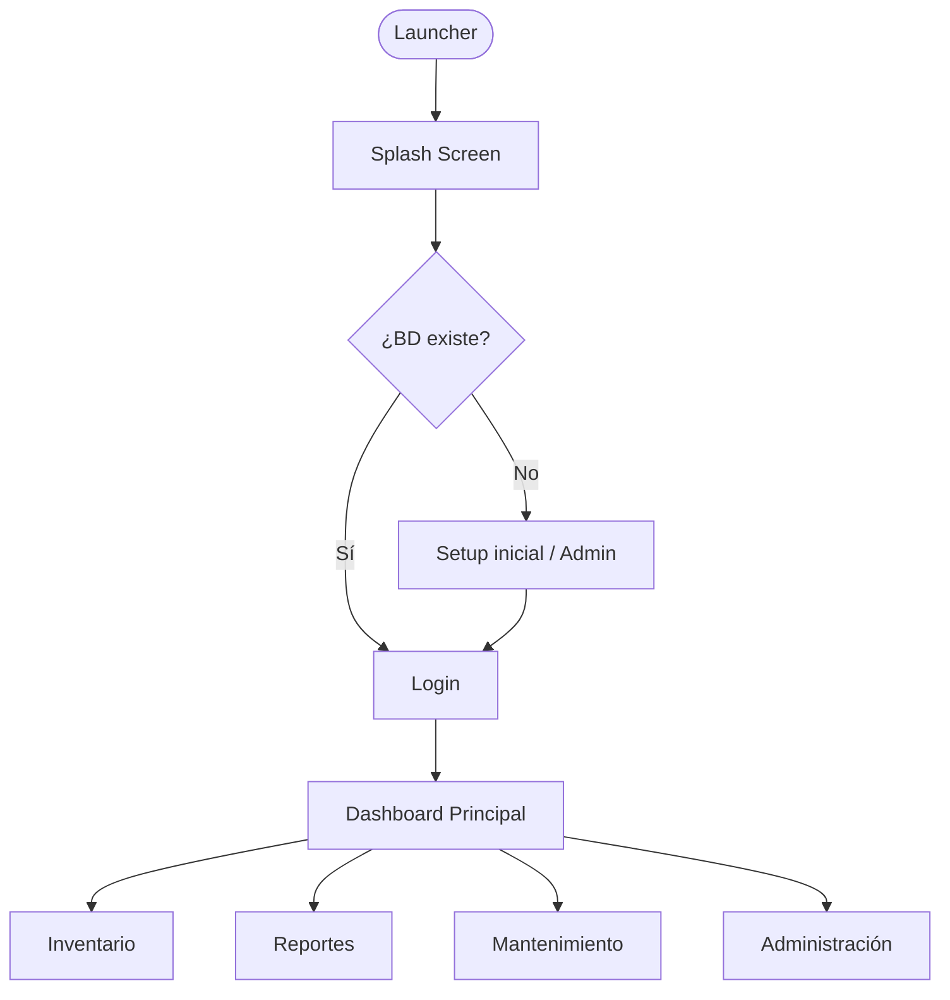

<div align="center">


[](https://git.io/typing-svg)

<br>

[](https://adoptium.net/)
[](https://openjfx.io/)
[](https://maven.apache.org/)
[](https://www.sqlite.org/)
[]()

</div>

---

##  Vista General

**PCS Inventario** es una aplicación de escritorio **100% portable** para la gestión integral de inventarios de equipos de cómputo. Desarrollada con **Java 17** y **JavaFX 21**, no requiere instalación y funciona completamente sin conexión a internet.

---

##  Características Principales

<table>
<tr>
<td width="50%">

###  Inventario & Proyectos
- Gestión completa de equipos por proyecto
- Registro de especificaciones técnicas
- Historial de cambios y auditoría

###  Seguridad
- Base de datos **SQLite cifrada con AES-256**
- Control de acceso por roles
- Panel de administración con log de actividad

</td>
<td width="50%">

###  Reportes
- Exportación a **Excel** (Apache POI)
- Generación de **PDF**
- Reportes de mantenimiento

###  Experiencia de Usuario
- Tema **claro / oscuro** (cambio en tiempo real)
- Interfaz moderna con animaciones JavaFX
- **Backup automático** y restauración con un clic

</td>
</tr>
</table>

---

##  Stack Tecnológico

<div align="center">

| Componente | Tecnología | Versión |
|:---:|:---:|:---:|
|  Lenguaje | Java (Temurin) | 17 LTS |
|  UI | JavaFX | 21 |
|  Base de datos | SQLite + JDBC | 3.x |
|  Excel | Apache POI | 5.x |
|  Cifrado | AES-256 (javax.crypto) |  |
|  Build | Apache Maven | 3.x |
|  Empaquetado | Launch4j + jlink |  |

</div>

---

##  Cómo Usar

### Requisitos
- **Java 17+** (solo para compilar; el portable incluye su propio JRE)
- **Apache Maven 3.6+**

###  Compilar
```bash
mvn clean compile
```

###  Ejecutar en modo desarrollo
```bash
mvn javafx:run
```

###  Generar ejecutable portable (.exe)
```bash
mvn clean package -DskipTests
```

> El ejecutable **`Inventario.exe`** se genera en `target/` junto con el JRE embebido en `target/jre/`.
> Solo copia la carpeta `target/Inventario-Portable/` a donde quieras  **no necesita instalación**.

---

##  Estructura del Proyecto

```
 pcs-inventario
   src/main/java/inventario/fx/
    config/         Configuración, backup, rutas portables
    core/           Punto de entrada (InventarioFX, Launcher)
    database/       DatabaseManager + repositorios
    excel/          Generación de Excel y PDF
    icons/          Iconos SVG inline
    model/          Modelos de dominio y managers
    security/       Cifrado AES-256 y gestión de seguridad
    service/        Servicios de negocio
    ui/
     component/    Componentes reutilizables (Notificaciones, etc.)
     dialog/       Diálogos modales
     panel/        Paneles principales (Dashboard, Admin, Reportes...)
    util/           Utilidades (AppLogger, ScreenUtils...)
   src/main/resources/
    fonts/          Montserrat
    icons/          Íconos de la aplicación
    styles/         CSS (tema claro, oscuro, fixes)
   pom.xml
```

---

##  Flujo de la Aplicación



---

##  Seguridad

- La base de datos SQLite está **cifrada con AES-256**  ningún visor externo puede leerla sin la clave.
- Las contraseñas se almacenan con **hash + salt**.
- Toda actividad administrativa queda registrada en el **log de auditoría**.

---

##  Estado del Proyecto

>  **En desarrollo activo**  Se agregan mejoras continuas de UX, rendimiento y seguridad.

---

<div align="center">


**Hecho con  Java  JavaFX  y mucho esfuerzo**

 20242026  Uso interno. Todos los derechos reservados.

</div>